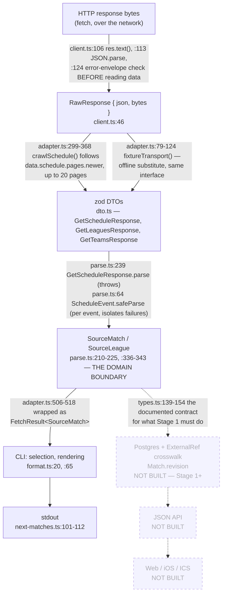
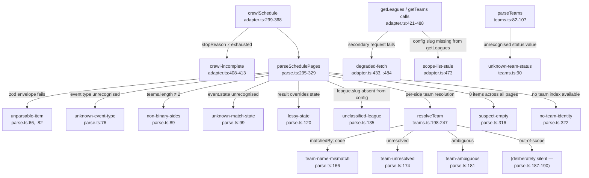

# Data flow: wire → domain

How a Riot REST JSON field becomes a row this project renders. Written because no document
answered this before Stage 0.8 — `grep -r SourceMatch docs/ README.md CLAUDE.md` returned zero
hits; the mapping existed only as code (`parse.ts`) and as scattered provenance comments in
`types.ts`. This is the reference for both a human onboarding and an agent about to touch the
adapter boundary.

Every `file:line` below was read directly out of the file at the time this was written (Stage
0.8, 2026-08-12) — not carried over from an earlier exploration. If a line number here is stale,
that is a bug in this document, not a hint that the code moved for a good reason.

For *why* each boundary claim is true (probed vs. assumed, sample sizes, corrections), see
`docs/sources/lolesports-rest.md` and `docs/sources/riot-rest-parameters.md`. This document is the
**map**; those are the **evidence**.

## 1. Lifecycle: HTTP bytes → a printed line

Only one adapter exists (`riot-rest-lol`) and only one sink exists (the CLI). Stage 1's Postgres
layer, and everything past it, is drawn dashed because none of it has been written — the only
trace of it in the repo today is `docker-compose.yml`'s `postgres:17-alpine` service declaration
and the `Source*` → domain contract documented in `types.ts:139-154`.

Three boundaries worth naming on their own, because each is the *only* place something happens:

- **`parseUtcInstant`** (`time.ts:45-54`) is the only place a timestamp string becomes a number,
  and it refuses an unzoned string rather than guessing. Called at ingest (`parse.ts:217`, inside
  `normalizeToUtcIso`) and again at render (`format.ts:26`, `format.ts:66` via `formatInZone`).
- **`toHttps`** (`https.ts:16-19`) rewrites `http://` → `https://` at the adapter boundary, not at
  render, so every future consumer — web, ICS, iOS — gets the same URL without repeating the fix.
- **`IDENTITY_LOCALE = 'en-US'`** (`client.ts:24`, applied unconditionally at `client.ts:75`) pins
  every request's `hl`, because `blockName`, `tournament.name`, and `homeLeague.name` are all
  translated and identity has to resolve from one fixed locale.

**Directory containment**: nothing outside `src/sources/riot/rest/` may import the zod DTOs
(`dto.ts:2-3`) or `RiotTeamRecord` (`teams.ts:49-50` — "What leaves is a `SourceTeam` with
`externalId` populated"). The only line crossing out of that directory is the DTO → `SourceMatch`
mapping in `parse.ts`.

## 2. The three-endpoint join

The genuinely hard part to hold in one's head: no single endpoint has both a team's name *and* its
identity *and* its league's canonical id. Three calls, three partial facts, joined in memory.

```mermaid
flowchart LR
    subgraph GS["getSchedule (primary, crawled)"]
        GSF["league { name, slug }\nteams[] { name, code } — NO id\nmatch.strategy.count, teams[].result"]
    end
    subgraph GL["getLeagues (secondary)"]
        GLF["id, slug, name, region"]
    end
    subgraph GT["getTeams (secondary, one call)"]
        GTF["id, name, code, status,\nhomeLeague { name, region } — NO slug, NO id"]
    end

    GSF -->|"league.slug"| SLUG(("slug"))
    GLF -->|"slug → id"| SLUG
    GLF -->|"slug → name\nadapter.ts:466-481"| LNAME(("league name,\nlocalized"))
    GTF -->|"homeLeague.name"| LNAME
    LNAME -->|"teams.ts:146-166 buildTeamIndex\nfilters status=active AND\nhomeLeagueName ∈ covered regional leagues"| INDEX["TeamIndex\nbyName (primary), byCode (fallback)"]
    GSF -->|"name, code"| INDEX
    INDEX -->|"teams.ts:198-247 resolveTeam\nname hit → resolved\nname miss → code fallback\nneither → unresolved / ambiguous"| RESOLVED["SourceTeam.externalId"]

    style GS fill:#1a3a1a,stroke:#4a8a4a
    style GL fill:#1a2a4a,stroke:#4a6a9a
    style GT fill:#3a2a1a,stroke:#9a6a4a
```

Two consequences of this shape, both load-bearing:

- **`hl=en-US` is load-bearing for identity in two independent places, not one.** `blockName` and
  `tournament.name` translate on `getSchedule`; `homeLeague.name` translates on `getTeams`
  (`teams.ts:73-77`) and it is the *only* handle from a team to a league — no slug, no id. Mixing
  locales across the two calls would silently produce an empty team table rather than an error.
  Stage 0.8 tested this directly, same-instant, at full scale (1568/1568 teams, zero name
  mismatches under `hl=zh-TW` vs `hl=en-US`) — see `riot-rest-parameters.md`'s `teams-hl-zh-tw`
  probe.
- **A `getLeagues` failure degrades team identity, not just league ids.** `adapter.ts:452-457`: if
  `leagueNameBySlug` is unavailable, the covered region slugs can't be translated into the
  localized names `getTeams` uses, so `getTeams` is never even called — the `no-team-identity`
  warning fires before a third request is spent on it. A reader who only knows "`getLeagues`
  supplies league ids" would not predict this.

## 3. Field-by-field crosswalk

Every `SourceMatch` field (`types.ts:175-205`), where it comes from, and the transformation.

| `SourceMatch` field | Wire source | Transformation | Where |
|---|---|---|---|
| `externalId` | `event.match.id` | verbatim | `parse.ts:211` |
| `game` | — | injected by caller (`'lol'`, hardcoded in the adapter) | `parse.ts:212` |
| `leagueExternalId` | `getLeagues` id, joined by `event.league.slug` | `leagueIdBySlug.get(slug) ?? null` — cross-endpoint lookup | `parse.ts:213` |
| `leagueSlug` | `event.league.slug` | verbatim | `parse.ts:214` |
| `tournamentExternalId` | — | always `null` — `getSchedule` carries no tournament object for LoL | `parse.ts:216` |
| `startsAtUtc` | `event.startTime` | `normalizeToUtcIso` — throws `TimestampError` on a missing zone marker | `parse.ts:217`, `time.ts:45-63` |
| `state` | `event.state` **overridden by** `teams[].result` | `KNOWN_STATES` lookup, then: any null `result` on either side ⇒ `'unstarted'`, whatever `state` said | `parse.ts:97-125` |
| `seriesLength` | `event.match.strategy.count` | verbatim | `parse.ts:219` |
| `gamesPlayed` | `sides[].score` | `sides.reduce((sum, s) => sum + (s.score ?? 0), 0)` — summed, not copied from `seriesLength` | `parse.ts:208` |
| `sides` | `event.match.teams` | mapped per-side, see below, cast to a 2-tuple | `parse.ts:142-201`, `:220` |
| `stageLabel` | `event.blockName` | `?? null` — localized, display only, never a key | `parse.ts:222` |
| `streamUrl` | — | always `null` — settled (`streamUrls: false`), `League.defaultStreamUrl` is the fallback | `parse.ts:224` |

Per-side (`SourceSide` / `SourceTeam`, `types.ts:170-173`, `:155-167`):

| Field | Wire source | Transformation | Where |
|---|---|---|---|
| whole side | `teams[i]` | `isTbd(t)` (both `code === 'TBD'` **and** `result` null/undefined) ⇒ `{team: null, score: null}` | `parse.ts:55-57`, `:143` |
| `externalId` | **`teams.ts` join result**, not the wire at all | `resolveTeam` against the `getTeams`-built index; `null` if unresolved/ambiguous/out-of-scope | `parse.ts:150-159` |
| `name` | `t.name` | verbatim | `parse.ts:196` |
| `code` | `t.code` | verbatim | `parse.ts:197` |
| `logoUrl` | `t.image`, **overwritten** by the resolved team's `getTeams` image if resolution succeeded | `toHttps(t.image)`, then `resolution.team.logoUrl ?? logoUrl` | `parse.ts:147-148`, `:160-162` |
| `score` | `t.result?.gameWins` | `?? null` | `parse.ts:200` |

`SourceLeague` (`types.ts:212-219`), from `parseLeagues` (`parse.ts:331-351`):

| Field | Wire source | Transformation |
|---|---|---|
| `externalId` | `l.id` | verbatim |
| `game` | — | injected |
| `slug`, `name` | `l.slug`, `l.name` | verbatim |
| `region` | `l.region` | `?? null` |
| `logoUrl` | `l.image` | `toHttps(l.image)` |

## 4. What does *not* come from the API

Equal billing with the crosswalk above — these are what most often get silently reinvented by
someone reading only the happy-path fields.

| Domain concept | Why it isn't from the wire |
|---|---|
| `League.tier` | No tier signal exists anywhere in Riot's API — `getLeagues.priority` is `1` for all 45 leagues, `displayPriority` is per-request UI state (`lolesports-rest.md:196-214`). Ours, in `config/leagues.json`, and it is a **product decision**, not a derivation (`leagues.ts:4-7`). |
| `League.defaultStreamUrl`, `Match.streamUrl` | Riot supplies no stream links anywhere in this API surface — settled as of Stage 0, `capabilities.streamUrls: false` (`adapter.ts:149-150`). Ours to hand-maintain. |
| Canonical ids (`Team.id`, `League.id`, `Match.id`, …) | An adapter has no database and must not acquire one (NFR-2), so it cannot mint a canonical id — inventing one would break idempotent ingestion on the next run. `Source*` records carry only the source's own external id; the crosswalk (`ExternalRef`, `types.ts:245-262`) is Stage 1's job. |
| `Match.revision` | "A property of what we have already stored, not of what a source said" (`types.ts:151-152`) — deliberately absent from `SourceMatch`, only the sync layer can compute it. |
| Any match end time | Riot supplies none. SPEC §1: duration is estimated from `best_of` at render, never stored as a fabricated `ends_at_utc`. |
| `LeagueKind` (`region` vs `event`) | Ours, in `config/leagues.ts:26` — decides which majors may contribute rows to the team table (`teamHomeLeagueSlugs()`, `leagues.ts:75-82`), because `getTeams` homes seven junk rows at Worlds/MSI that are not real playing teams (`lolesports-rest.md:390-407`). |

## 5. Where each warning fires, on the pipeline

`WarningCode` (`warnings.ts:14-122`) positioned on the flow above — "does `crawl-incomplete` fire
before or after team resolution" is answerable from this table without reading the source.

`state-inferred` (`warnings.ts:52`) has no emitter in this adapter at all — it exists for BLAST,
whose `/matches` endpoint carries no state field to read in the first place. Kept in the shared
vocabulary rather than added when BLAST is built, so the `state-inferred` vs `lossy-state`
distinction ("nothing to read" vs "what we read was wrong") is decided once, not re-litigated
under time pressure while writing a second adapter.

## 6. Capability flags as wire facts

Each `SourceCapabilities` flag (`source.ts:45-94`), and the specific endpoint behaviour that
justifies its value — two of these read as understatements if you only know the field exists, not
why the flag says what it does.

| Flag | Value | The wire fact behind it |
|---|---|---|
| `scopeDiscovery` | `'implicit'` | `getSchedule` takes no scope parameter and returns every league in one call — there is nothing to enumerate. |
| `explicitState` | **`false`**, despite `event.state` existing | The field is provably wrong for matches with an undecided opponent — 3 of 7 TBD matches `completed`, 4 `unstarted`, no consistent rule, in the captured sample (`lolesports-rest.md:141-149`). `parse.ts:116-117` overrides it from `teams[].result` instead. The flag describes *provenance* — a corrected field is an inference — not field existence. |
| `teamIdentity` | `true` | Not a fact about `getSchedule` (which has zero team ids — `dto.ts:32-35`), but about the *adapter*, which joins it against `getTeams`. Stays `true` on a degraded run: a transient `getTeams` failure produces `no-team-identity` warnings, not a capability flip (`adapter.ts:144-147`). |
| `streamUrls` | `false` | No `streams` key anywhere in `getSchedule`. Settled, not pending — `League.defaultStreamUrl` is the product's answer. |
| `timeWindow` | **`false`**, despite `fetchMatches` sending a real `pageToken` | The cursor is used to crawl the *whole* forward horizon to exhaustion, not to narrow to a caller-supplied range — the opposite of what `timeWindow: true` would mean. The `window` argument is ignored outright (`adapter.ts:394`, `_window` unused). Pinned to the behaviour in `tests/riot-rest-adapter.test.ts`'s window-invariance test, per CLAUDE.md's rule that a capability flag describes the code, not the endpoint's theoretical reach. |

`historicalBackfill` is commented out of the interface entirely (`source.ts:92-93`) rather than
declared `false` — Stage 0.7 resolved the forward direction; the `older` direction has been probed
(Stage 0.7: 6 pages, did not terminate; Stage 0.8: 3 pages, reconfirmed contiguous, still
non-null) but never implemented, so there is no adapter behaviour yet for a flag to describe.
